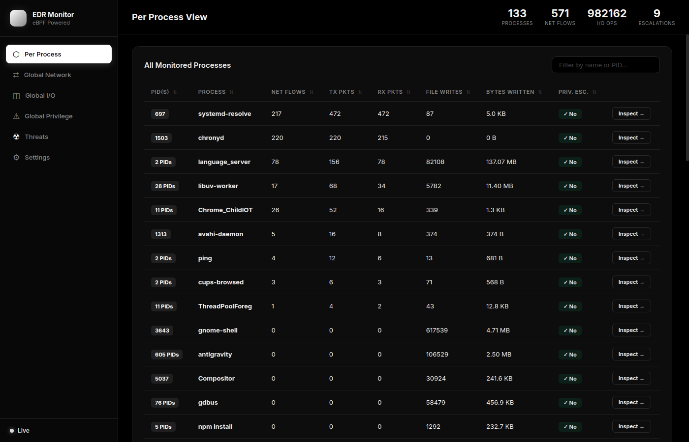
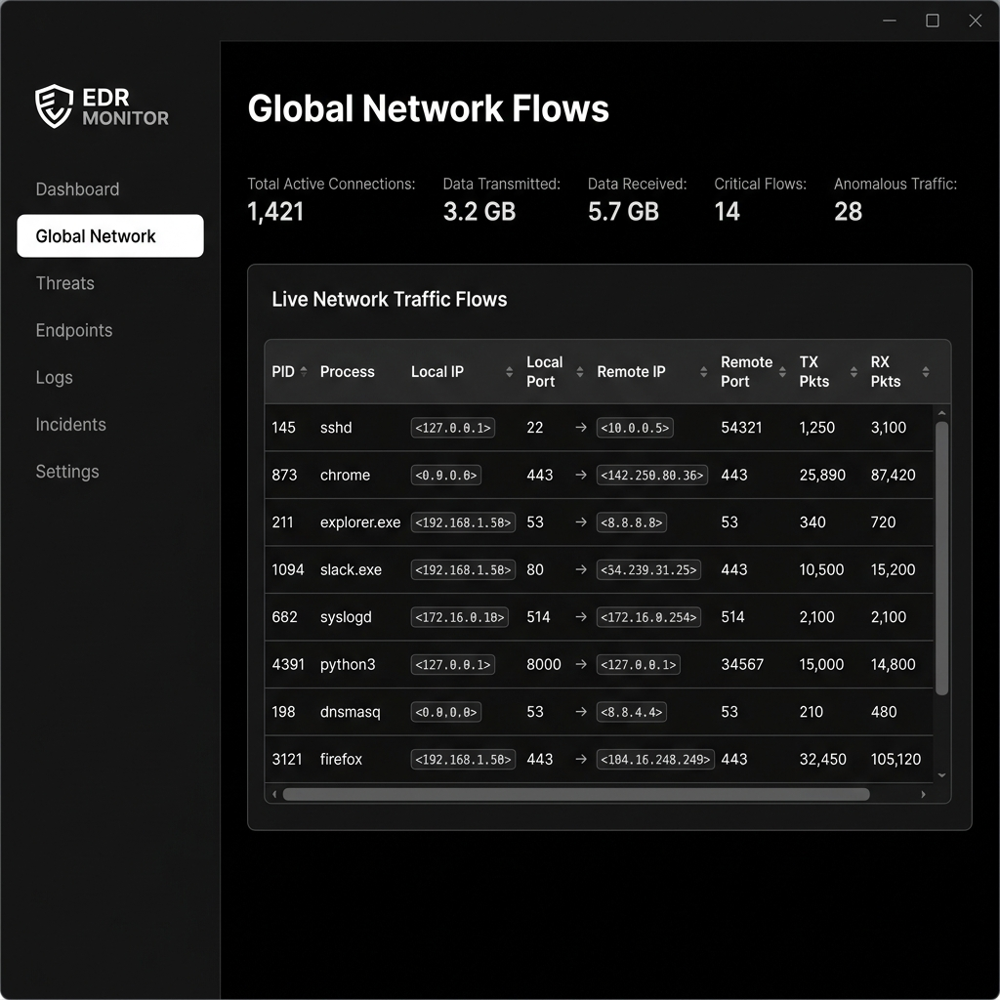
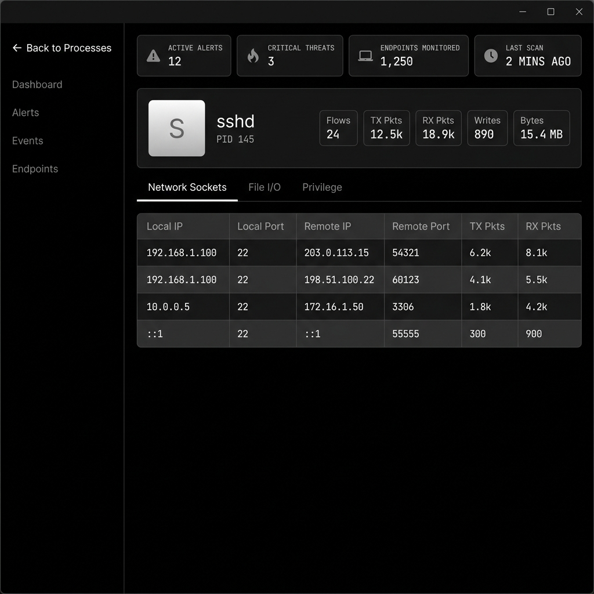
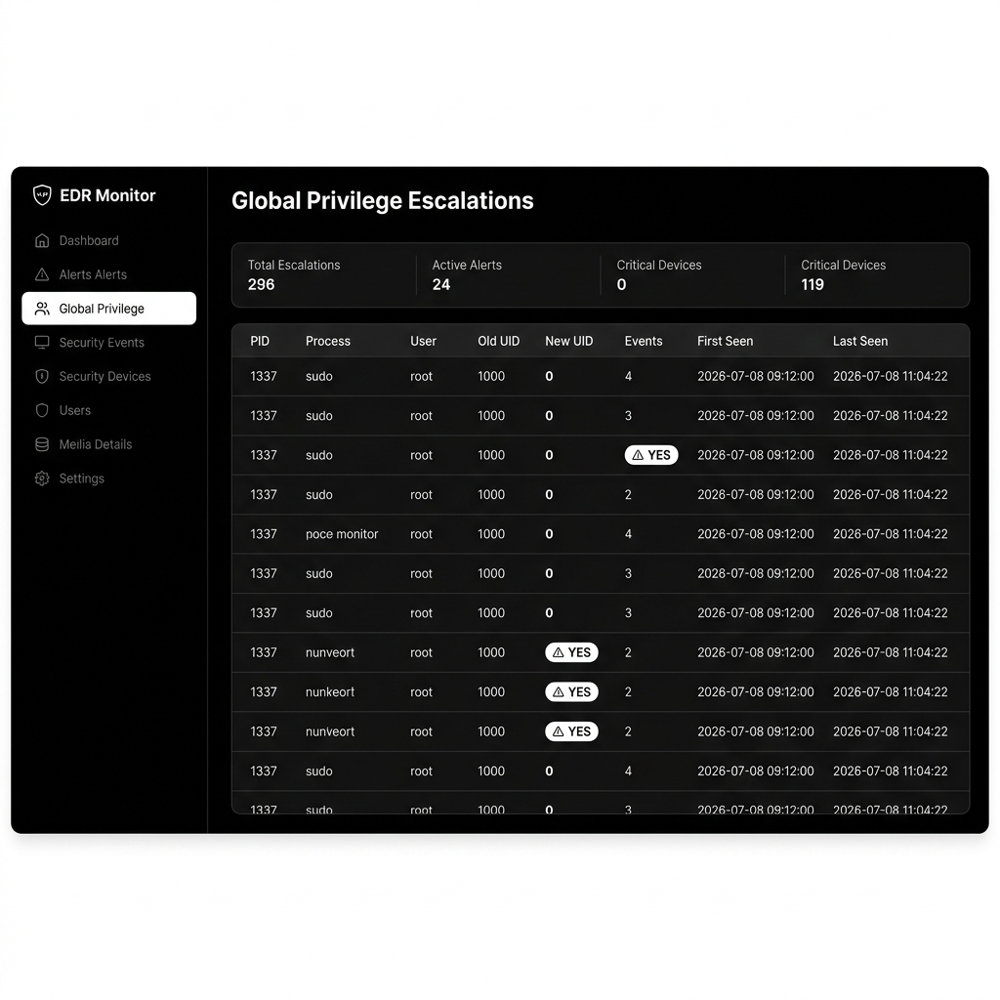
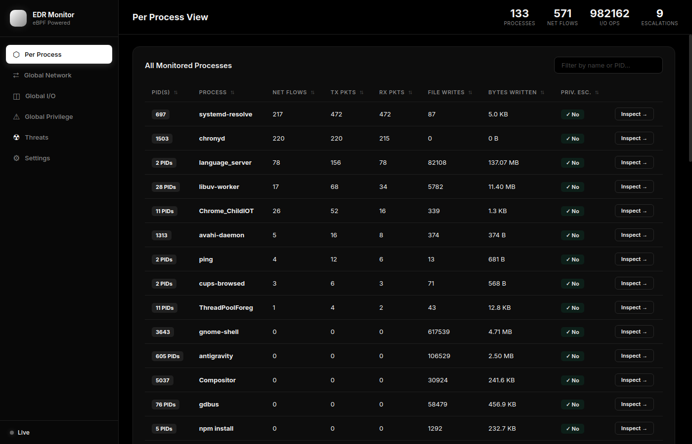
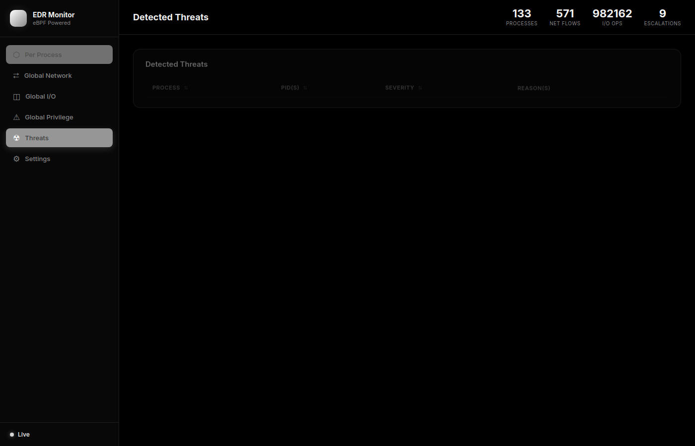
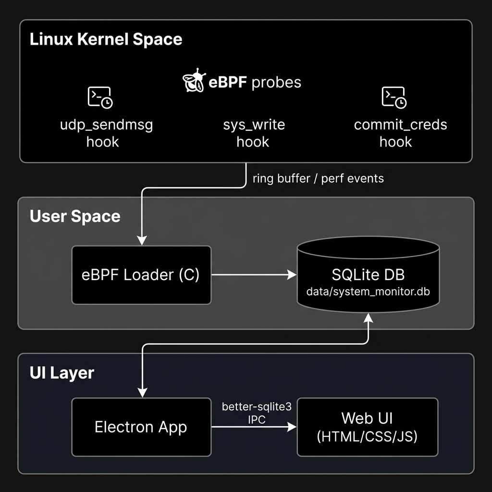

<div align="center">

# Unified EDR Monitor

**A Linux kernel-level Endpoint Detection & Response system powered by eBPF**

[](LICENSE)
[]()
[]()
[]()

*Real-time process telemetry — network flows, file I/O, and privilege escalation — collected directly from the Linux kernel with zero agent overhead.*

</div>

---

## Screenshots

### Per-Process Overview
> Every running process aggregated by network activity, file writes, and privilege escalation status. Click any row to drill into process-level detail.



---

### Global Network Flows
> Full real-time table of all UDP/TCP flows across every monitored process. Sortable by any column.



---

### Process Detail — Deep Inspection
> Drill into any process: see its individual network sockets, file descriptors, bytes written, and privilege events — all live-updating without a page reload.



---

### Global Privilege Escalations
> Kernel-level detection of `commit_creds()` calls. Captures UID transitions, escalation count, and first/last-seen timestamps.



---

### Threat Detection Engine
> Real-time evaluation of suspicious behavior. Automatically flags ransomware behavior (rapid file modifications), suspicious binaries with network connections, and data exfiltration heuristics.



---

### Configurable Threat Rules
> Dynamic Settings panel to configure threat detection rules on the fly without restarting the application.


---

## Architecture



The system is built in three layers with no agent running in the cloud:

| Layer | Component | Technology |
|---|---|---|
| **Kernel** | eBPF probes | `udp_sendmsg`, `sys_write`, `commit_creds` hooks |
| **User Space** | eBPF loader + DB writer | C + libbpf + SQLite |
| **UI** | Standalone desktop app | Electron + better-sqlite3 + HTML/CSS/JS |

Data flows: **Kernel → ring buffer → C loader → SQLite → Electron IPC → Web UI**

No HTTP server. No Python server. No external network calls. The UI reads directly from the local SQLite database via Electron's main process.

---

## Features

- 🔍 **Per-process telemetry** — network flows, file I/O, and privilege data aggregated per PID
- 🌐 **Global views** — full tables across all monitored processes for network, I/O, and privilege events
- 🔐 **Privilege escalation detection** — hooks `commit_creds()` to detect UID `1000 → 0` transitions in real-time
- ⚡ **Zero-overhead kernel collection** — eBPF probes attach and detach with no kernel module required
- 🖥️ **Standalone Electron UI** — no server dependency; reads SQLite directly via `better-sqlite3`
- 🔄 **Smooth live updates** — keyed DOM diffing engine patches only changed cells (no scroll-jump or flicker)
- 📊 **Sortable, filterable tables** — sort state persists across live refreshes
- 💾 **SQLite persistence** — all events stored with timestamps for forensic review

---

## Project Structure

```
.
├── Makefile
├── src/
│   ├── kern/
│   │   └── monitor_kern.c        # eBPF kernel programs (probes)
│   ├── user/
│   │   └── monitor_backend.c     # User-space loader: reads ring buffer → writes SQLite
│   └── ui/
│       ├── web/
│       │   ├── index.html        # Dashboard markup
│       │   ├── style.css         # Monochrome dark theme
│       │   └── script.js         # Keyed-diff update engine
│       └── desktop_app/
│           ├── main.js           # Electron main process (SQLite queries via IPC)
│           ├── preload.js        # Secure IPC bridge (contextBridge)
│           └── package.json
├── data/
│   └── system_monitor.db         # SQLite database (auto-created at runtime)
├── include/
│   └── vmlinux.h                 # BTF type definitions (generated locally)
└── bin/                          # Compiled binaries
```

---

## Prerequisites

```bash
# Debian/Ubuntu
sudo apt install -y clang gcc libbpf-dev libelf-dev zlib1g-dev \
                    sqlite3 libsqlite3-dev linux-headers-$(uname -r) \
                    nodejs npm bpftool
```

> **Note:** eBPF requires Linux kernel **≥ 5.8** with BTF enabled (`CONFIG_DEBUG_INFO_BTF=y`).  
> Check with: `ls /sys/kernel/btf/vmlinux`

---

## Quick Start

### 1. Generate BTF headers (first time only)

```bash
make vmlinux
```

### 2. Build the eBPF backend

```bash
make
```

### 3. Run the kernel monitor (requires root)

```bash
make run
# or: sudo ./bin/monitor_backend
```

This attaches the eBPF probes and starts writing events to `data/system_monitor.db`.

### 4. Launch the desktop UI (separate terminal)

```bash
make app
```

The Electron window opens and reads the live database directly — no server needed.

---

## Makefile Reference

| Target | Description |
|---|---|
| `make` | Build eBPF kernel object + user-space loader |
| `make run` | Build and run the backend (requires `sudo`) |
| `make app` | Launch the Electron desktop UI |
| `make vmlinux` | Generate `include/vmlinux.h` from the running kernel |
| `make static` | Full static build (no `.so` runtime dependencies) |
| `make viewdb` | Print top 15 UDP flows from the SQLite database |
| `make export` | Export all tables to CSV files |
| `make cleardb` | Delete the SQLite database and WAL files |
| `make clean` | Remove compiled binaries |
| `make trace` | Tail the live kernel trace pipe (`/sys/kernel/debug/tracing/trace_pipe`) |

---

## Monitored Events

### UDP Network Flows (`udp_flows` table)
Captured via `udp_sendmsg` kprobe.

| Column | Description |
|---|---|
| `pid` | Process ID |
| `comm` | Process name |
| `local_ip` / `local_port` | Source address |
| `remote_ip` / `remote_port` | Destination address |
| `tx_packets` / `rx_packets` | Packet counters |

### File Writes (`file_writes` table)
Captured via `sys_write` tracepoint.

| Column | Description |
|---|---|
| `pid`, `comm` | Process identity |
| `fd` | File descriptor |
| `write_calls` | Number of write syscalls |
| `bytes_written` | Total bytes written |

### Privilege Escalations (`priv_esc` table)
Captured via `commit_creds` kprobe.

| Column | Description |
|---|---|
| `pid`, `comm`, `username` | Process identity |
| `old_uid` → `new_uid` | UID transition (e.g. `1000 → 0`) |
| `escalation_count` | Number of times escalated |
| `first_seen`, `last_seen` | Unix timestamps |

---

## UI Update Engine

The dashboard polls the SQLite database every **2 seconds** using a keyed DOM diffing engine (`patchTable`):

- **No full DOM wipe** — rows are patched in-place; only changed cells get `innerHTML` updated
- **No scroll jump** — the DOM is never rebuilt, so scroll position is naturally preserved  
- **Click handlers attached once** — event listeners are bound when a row is first created, not on every tick
- **Page Visibility API** — polling pauses when the window is hidden; resumes immediately on focus

---

## Security Notes

> ⚠️ The eBPF backend must run as **root** to attach kernel probes.  
> The UI runs in user space with no elevated privileges.

- eBPF programs are verified by the Linux kernel verifier before loading
- No network traffic is generated by the monitor itself
- All data stays on the local machine in `data/system_monitor.db`
- The Electron app uses `contextBridge` with a restricted API (no `nodeIntegration`)

---

## License

MIT © Abhishek Khade
